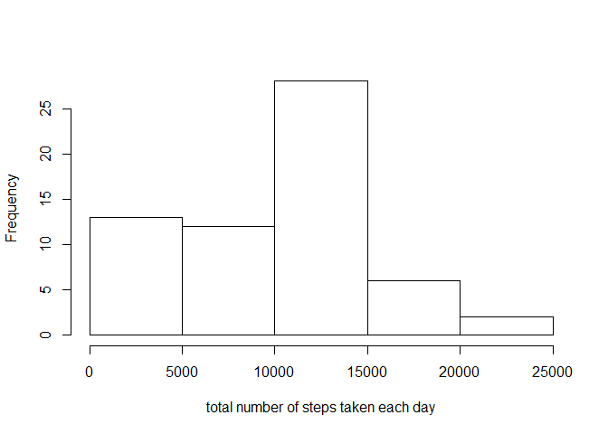
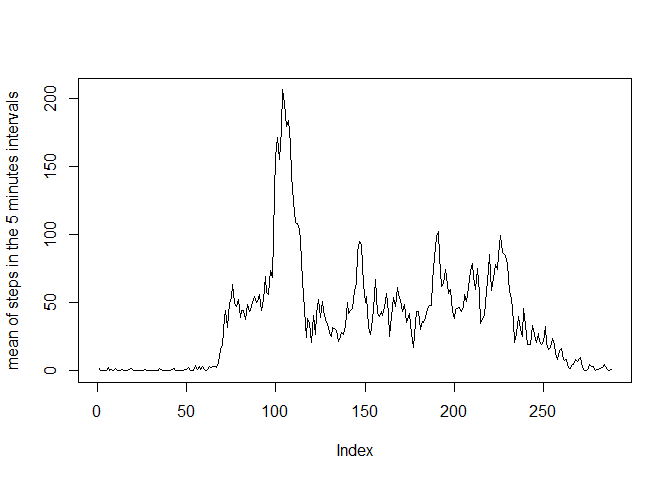
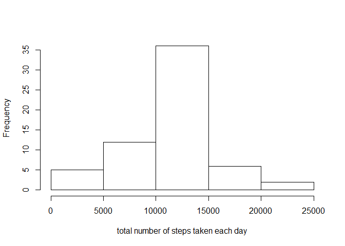
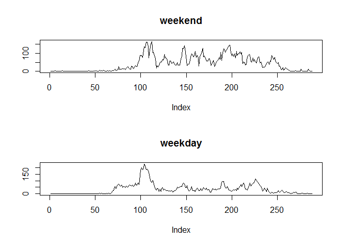

## Introduction
This assignment makes use of data from a personal activity monitoring device. This device collects data at 5 minute intervals through out the day. The data consists of two months of data from an anonymous individual collected during the months of October and November, 2012 and include the number of steps taken in 5 minute intervals each day.

The variables included in this dataset are:

 * steps: Number of steps taking in a 5-minute interval (missing values are coded as \color{red}{\verb|NA|}NA)
 * date: The date on which the measurement was taken in YYYY-MM-DD format
 * interval: Identifier for the 5-minute interval in which measurement was taken

## Loading and preprocessing the data

```r
library(plyr)
library(dplyr)
```

```
## 
## Attaching package: 'dplyr'
```

```
## The following objects are masked from 'package:plyr':
## 
##     arrange, count, desc, failwith, id, mutate, rename, summarise,
##     summarize
```

```
## The following objects are masked from 'package:stats':
## 
##     filter, lag
```

```
## The following objects are masked from 'package:base':
## 
##     intersect, setdiff, setequal, union
```

```r
activity<-read.csv("repdata_data_activity/activity.csv")

table_activity<-tbl_df(activity)

by_date<-group_by(table_activity,date)

by_date_sum_steps<-summarise(by_date,sum(steps,na.rm = TRUE))
```


## What is mean and median total number of steps taken per day?


```r
mean( by_date_sum_steps$`sum(steps, na.rm = TRUE)` )
```

```
## [1] 9354.23
```

```r
median( by_date_sum_steps$`sum(steps, na.rm = TRUE)` )
```

```
## [1] 10395
```

## Histogram of the total number of steps taken each day


```r
hist(by_date_sum_steps$`sum(steps, na.rm = TRUE)`,xlab="total number of steps taken each day", main="")
```

<!-- -->


## What is the average daily activity pattern?


```r
by_interval<-group_by(table_activity,interval)
by_interval_mean_steps<-summarise(by_interval,mean(steps,na.rm = TRUE))
plot(by_interval_mean_steps$`mean(steps, na.rm = TRUE)`,type="l", ylab = "mean of steps in the 5 minutes intervals")
```

<!-- -->

## The 5-minute interval that, on average, contains the maximum number of steps


```r
max<-max(by_interval_mean_steps$`mean(steps, na.rm = TRUE)`)
w<-which(by_interval_mean_steps$`mean(steps, na.rm = TRUE)`==max)
activity[w,3]
```

```
## [1] 835
```


## Imputing missing values

```r
#number of missing values
sum(is.na(activity$steps) )
```

```
## [1] 2304
```

```r
# imputing missing values
# every missing data is filled with the average of the 5 minutes interval with the same identifier
activity_imv<-activity
for (i in 1:nrow(activity_imv))
{
  if (is.na(activity_imv[i,"steps"]) )
  {
    
    missing_interval<-activity_imv[i,"interval"]
    w2<-which(by_interval_mean_steps$interval==missing_interval)[1]
    activity_imv[i,"steps"]<-as.integer( trunc(by_interval_mean_steps[w2,2]) )
  } 
}


table_activity_imv<-tbl_df(activity_imv)

by_date_imv<-group_by(table_activity_imv,date)
by_date_imv_sum_steps<-summarise(by_date_imv,sum(steps))
```

## Mean and median number of steps taken each day after missing values are filled


```r
mean(by_date_imv_sum_steps$`sum(steps)`)
```

```
## [1] 10749.77
```

```r
median(by_date_imv_sum_steps$`sum(steps)`)
```

```
## [1] 10641
```


## Histogram of the total number of steps taken each day after missing values are imputed

```r
hist(by_date_imv_sum_steps$`sum(steps)`,xlab="total number of steps taken each day", main="")
```

<!-- -->


## Are there differences in activity patterns between weekdays and weekends?


```r
Sys.setlocale("LC_TIME", "English")
```

```
## [1] "English_United States.1252"
```

```r
wd<-weekdays(as.Date(as.character(activity_imv$date)))
weekend<-(wd=="Saturday")|(wd=="Sunday")


weekend_factor<-revalue( as.factor(weekend),c("TRUE"="weekend","FALSE"="weekday") )

weekend_activity<-activity_imv[weekend_factor=="weekend",]
weekday_activity<-activity_imv[weekend_factor=="weekday",]

table_weekend_activity<-tbl_df(weekend_activity)
weekend_by_interval<-group_by(table_weekend_activity,interval)
weekend_by_interval_mean_steps<-summarise(weekend_by_interval,mean(steps))


table_weekday_activity<-tbl_df(weekday_activity)
weekday_by_interval<-group_by(table_weekday_activity,interval)
weekday_by_interval_mean_steps<-summarise(weekday_by_interval,mean(steps))

par(mfrow=c(2,1))

plot(weekend_by_interval_mean_steps$`mean(steps)`,type="l",main = "weekend",ylab = "")
plot(weekday_by_interval_mean_steps$`mean(steps)`,type="l",main = "weekday",ylab = "")
```

<!-- -->

```r
plot.new()
rm(list=ls())
```

<!-- -->

