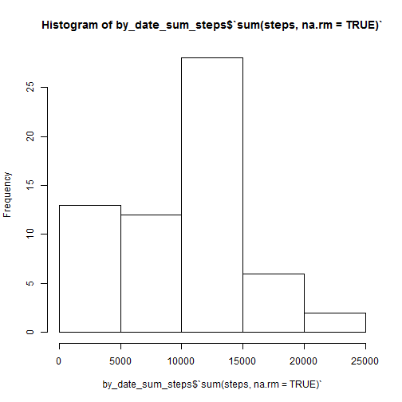
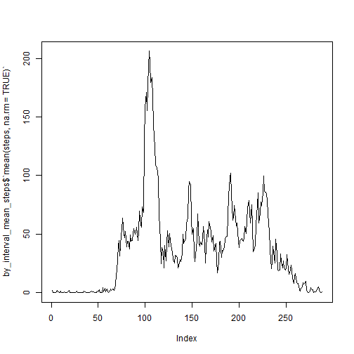
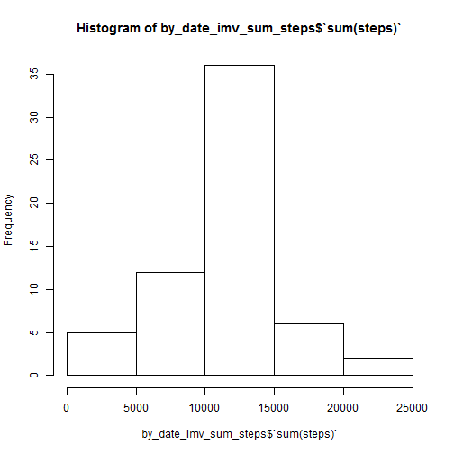
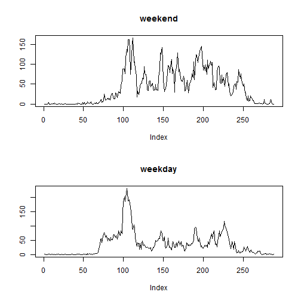

## R Markdown

This is an R Markdown document. Markdown is a simple formatting syntax for authoring HTML, PDF, and MS Word documents. For more details on using R Markdown see <http://rmarkdown.rstudio.com>.

When you click the **Knit** button a document will be generated that includes both content as well as the output of any embedded R code chunks within the document. You can embed an R code chunk like this:


```r
summary(cars)
```

```
##      speed           dist       
##  Min.   : 4.0   Min.   :  2.00  
##  1st Qu.:12.0   1st Qu.: 26.00  
##  Median :15.0   Median : 36.00  
##  Mean   :15.4   Mean   : 42.98  
##  3rd Qu.:19.0   3rd Qu.: 56.00  
##  Max.   :25.0   Max.   :120.00
```

## Including Plots

You can also embed plots, for example:


Note that the `echo = FALSE` parameter was added to the code chunk to prevent printing of the R code that generated the plot.


```r
activity<-read.csv("repdata_data_activity/activity.csv")


library(plyr)
library(dplyr)
```

```
## 
## Attaching package: 'dplyr'
```

```
## The following objects are masked from 'package:plyr':
## 
##     arrange, count, desc, failwith, id, mutate, rename, summarise,
##     summarize
```

```
## The following objects are masked from 'package:stats':
## 
##     filter, lag
```

```
## The following objects are masked from 'package:base':
## 
##     intersect, setdiff, setequal, union
```

```r
table_activity<-tbl_df(activity)

by_date<-group_by(table_activity,date)


by_date_sum_steps<-summarise(by_date,sum(steps,na.rm = TRUE))

hist(by_date_sum_steps$`sum(steps, na.rm = TRUE)`)
```



```r
mean( by_date_sum_steps$`sum(steps, na.rm = TRUE)` )
```

```
## [1] 9354.23
```

```r
median( by_date_sum_steps$`sum(steps, na.rm = TRUE)` )
```

```
## [1] 10395
```

```r
by_interval<-group_by(table_activity,interval)


by_interval_mean_steps<-summarise(by_interval,mean(steps,na.rm = TRUE))
plot(by_interval_mean_steps$`mean(steps, na.rm = TRUE)`,type="l")
```



```r
max<-max(by_interval_mean_steps$`mean(steps, na.rm = TRUE)`)
w<-which(by_interval_mean_steps$`mean(steps, na.rm = TRUE)`==max)
activity[w,3]
```

```
## [1] 835
```

```r
sum(is.na(activity$steps) )
```

```
## [1] 2304
```

```r
# imputing missing values
activity_imv<-activity
for (i in 1:nrow(activity_imv))
{
  if (is.na(activity_imv[i,"steps"]) )
  {
    
    missing_interval<-activity_imv[i,"interval"]
    w2<-which(by_interval_mean_steps$interval==missing_interval)[1]
    activity_imv[i,"steps"]<-as.integer( trunc(by_interval_mean_steps[w2,2]) )
  } 
}


table_activity_imv<-tbl_df(activity_imv)

by_date_imv<-group_by(table_activity_imv,date)
by_date_imv_sum_steps<-summarise(by_date_imv,sum(steps))
hist(by_date_imv_sum_steps$`sum(steps)`)
```



```r
mean(by_date_imv_sum_steps$`sum(steps)`)
```

```
## [1] 10749.77
```

```r
median(by_date_imv_sum_steps$`sum(steps)`)
```

```
## [1] 10641
```

```r
Sys.setlocale("LC_TIME", "English")
```

```
## [1] "English_United States.1252"
```

```r
wd<-weekdays(as.Date(as.character(activity_imv$date)))
weekend<-(wd=="Saturday")|(wd=="Sunday")


weekend_factor<-revalue( as.factor(weekend),c("TRUE"="weekend","FALSE"="weekday") )

weekend_activity<-activity_imv[weekend_factor=="weekend",]
weekday_activity<-activity_imv[weekend_factor=="weekday",]

table_weekend_activity<-tbl_df(weekend_activity)
weekend_by_interval<-group_by(table_weekend_activity,interval)
weekend_by_interval_mean_steps<-summarise(weekend_by_interval,mean(steps))


table_weekday_activity<-tbl_df(weekday_activity)
weekday_by_interval<-group_by(table_weekday_activity,interval)
weekday_by_interval_mean_steps<-summarise(weekday_by_interval,mean(steps))

par(mfrow=c(2,1))

plot(weekend_by_interval_mean_steps$`mean(steps)`,type="l",main = "weekend",ylab = "")
plot(weekday_by_interval_mean_steps$`mean(steps)`,type="l",main = "weekday",ylab = "")
```



```r
plot.new()
```


